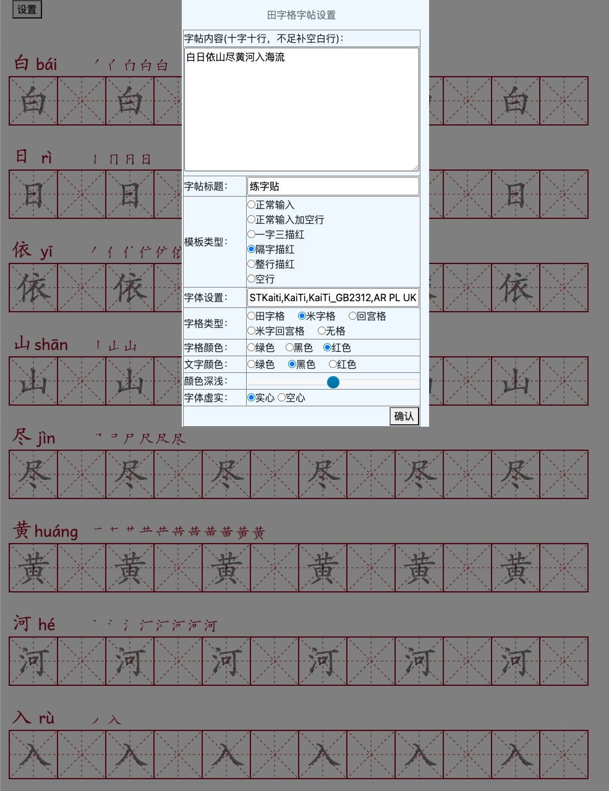
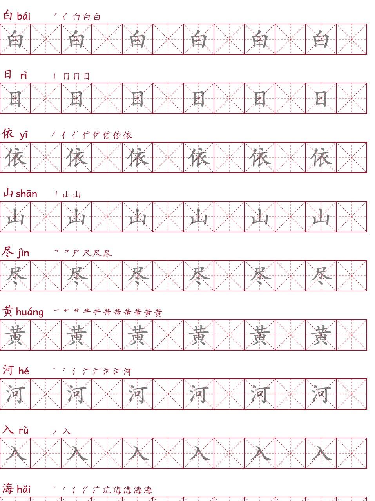

# Zitie-Maker

离线字帖生成器

> Forked 自 [https://github.com/gqw/zitie](https://github.com/gqw/zitie)，感谢原作者的辛苦劳动！

一款离线的字帖生成工具，不需要后台服务器，不需要联网，直接本地生成，小巧好用。

## 使用了如下开源库

核心功能通过下面两个库实现。
- Hanzi Writer: https://github.com/chanind/hanzi-writer
- pinyinjs: https://github.com/sxei/pinyinjs
